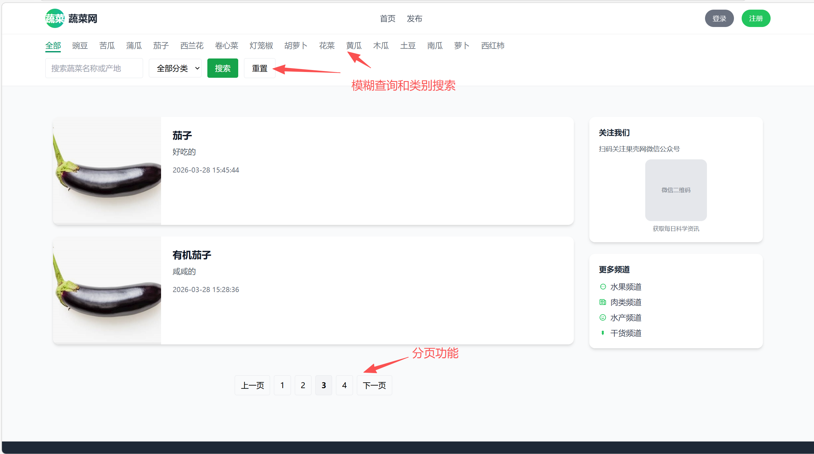
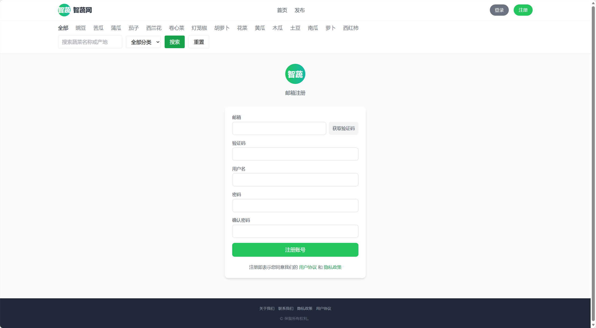
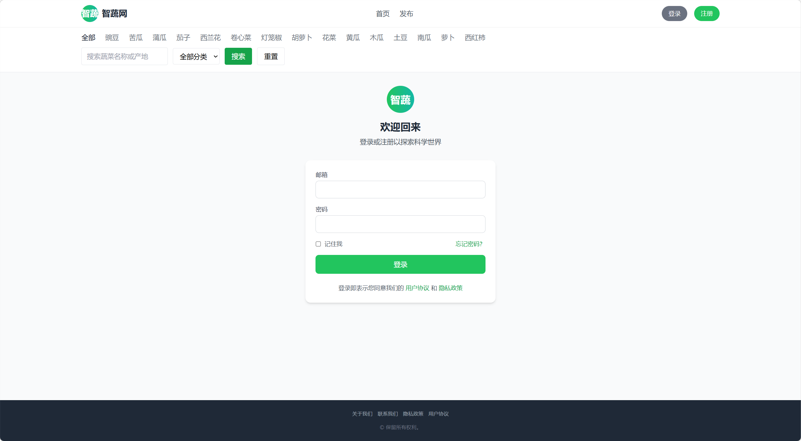
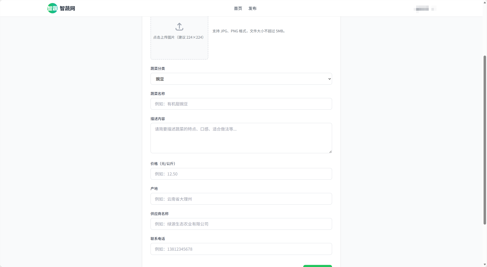
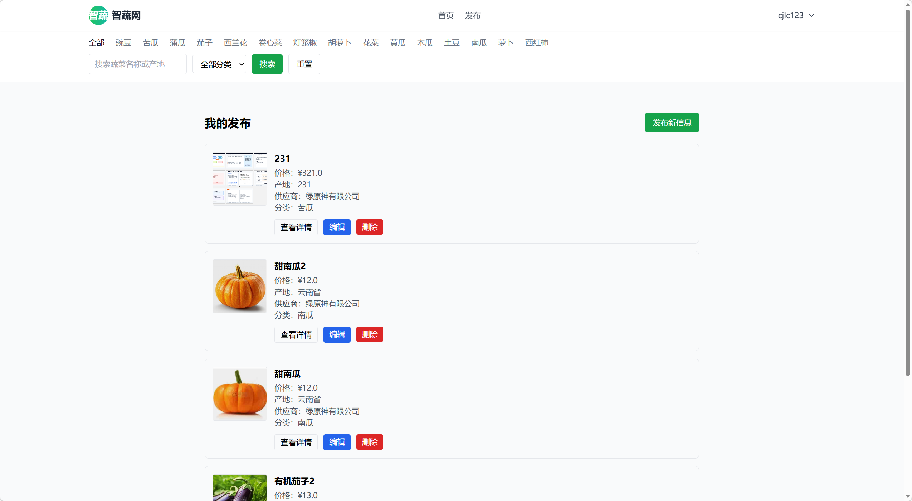
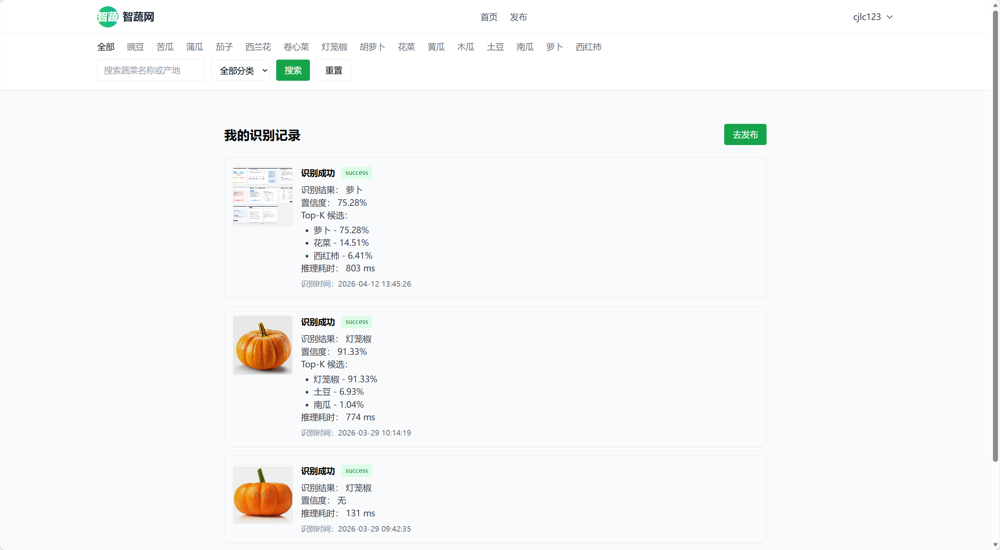
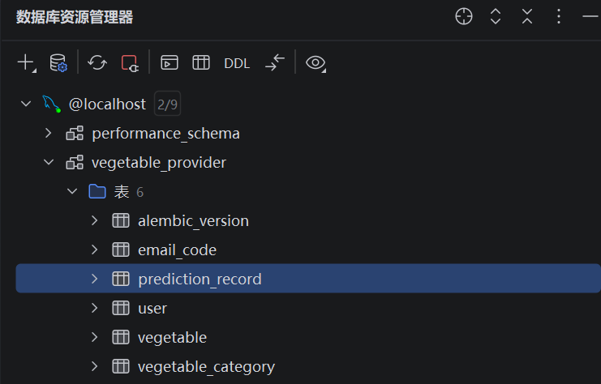

# 智能蔬菜供应平台

## 项目简介

- 智蔬供是一个基于Flask，将 **图像识别能力** 与 **农产品供需发布业务** 相结合的 Web 平台。
- 用户可以上传蔬菜图片，系统调用 PyTorch 图像分类模型自动识别类别，并将识别信息、预测概率回填入数据库中，方便后续维护。


- 本项目的重点不只是完成一个图片分类 demo，而是将 AI 推理接入真实业务流程，形成“**图片上传 → 模型推理 → 结果回填 → 信息发布 → 历史追踪**”的完整闭环。

---

## 项目背景

在农产品供需场景中，供货信息的录入通常依赖人工填写，存在分类繁琐、录入效率低的问题。  
本项目尝试通过图像分类模型自动识别蔬菜类别，减少用户手动选择分类的成本，并将识别结果接入信息发布流程，提升系统智能化程度。

---
## 项目亮点

### 1,Flask 应用工厂 + Blueprint 模块化
本项目采用 Flask 单体应用架构，按功能拆分为多个 Blueprint，整体结构如下：

- **表现层**：Jinja2 模板 + 静态资源
- **路由层**：按业务模块划分 Blueprint
- **业务层**：用户认证、信息发布、上传识别、搜索分页、历史记录
- **数据层**：SQLAlchemy ORM + MySQL
- **AI推理层**：PyTorch 本地模型加载与推理

### 2,MySQL 持久化 + Flask-Migrate 数据迁移
本项目采用 SQLAlchemy 操控MySQL数据库,表单信息存储于models.py文件。
- 采用migrate进行表单的更新并记录日志

整体表单如下

- **用户数据表**：存储了用户的邮箱、哈希加密的密码等。
- **蔬菜分类表**：存储了蔬菜的类别与id，通过上下文处理器加载到全局变量中。
- **蔬菜数据表**：存储了发布蔬菜的用户、图片等信息。与用户数据和蔬菜的分类表建立外键联系。
- **蔬菜预测表**：用于记录CNN模型的预测结果，存储了前三蔬菜的top-k、置信度等。
- **邮箱验证表**：用于用户注册账号时验证码的比对，记录了验证码、创建时间、请求邮箱等。

### 3,PyTorch 模型推理接入 Web 业务
本项目使用PyTorch的高级api构建CNN模型，用于自动预测用户传入图片中的蔬菜类别，模型信息存储于dlmodel文件夹下

- 统一处理图片的大小
- 输出预测概率而非单一结果
- 返回json数据包括top-k，置信度，耗时
- json数据展示再web页面
- json数据存储于MySQL便于校准

### 4,图片上传安全校验

- 限制图片后缀为.png\.jpg\.webp\.jpeg。限制信息存储于config.py
- 限制图片的大小
- 传入图片异常会有flash提示
- 传入图片路径存储于MySQL

### 5,搜索 + 分类筛选 + 真分页

- 支持筛选类别并筛选名称
- 使用SQLAlchemy进行名称模糊搜索
- 使用SQLAlchemy进行分页数据的筛选
- 将搜索后的数据传入前端页面

### 6,我的发布 / 编辑 / 删除

- 通过检测登录函数确定是否跳转页面
- 通过SQLAlchemy调取用户发布信息
- 查看所有用户发布信息并分页展示
- 删除或修改发布信息并更新数据库

### 7,Docker Compose 一键部署
本项目已实现docker部署的配置文件

---

## 技术栈

### 后端
- Flask
- Flask-SQLAlchemy
- Flask-Migrate
- Flask-Mail

### 数据库
- MySQL

### 前端
- Jinja2
- HTML / CSS / JavaScript
- jQuery
- Tailwind CSS

### AI 与图像处理
- PyTorch
- torchvision
- Pillow

---

## 功能特性

### 1. 用户模块
- 邮箱验证码注册
- 用户登录 / 退出登录
- 登录状态校验
- 登录后才能进行发布、编辑、删除、查看个人记录等操作

### 2. 农产品发布模块
- 发布供给信息
- 编辑自己的发布内容
- 删除自己的发布内容
- 查看“我的发布”
- 详情页展示供给信息

### 3. 图片识别模块
- 上传蔬菜图片
- 校验文件类型、大小和图片有效性
- 调用 PyTorch 模型完成图像分类
- 返回识别类别、置信度、Top-K 候选结果
- 自动回填分类到发布表单

### 4. 列表与检索模块
- 首页供给信息列表
- 按关键词搜索
- 按分类筛选
- 真分页查询
- 空结果提示

### 5. 识别历史模块
- 记录每次识别请求
- 保存识别结果、状态、置信度、Top-K、耗时等信息
- 支持查看“我的识别记录”

### 6. 权限与异常处理
- 用户只能编辑和删除自己的发布内容
- 资源不存在返回 404
- 越权操作返回 403
- 上传异常、数据库异常统一处理
- 数据库事务失败自动回滚

---

## 目录结构

```text
.
├── app/
│   ├── blueprints/
│   │   ├── auth.py
│   │   ├── main.py
│   │   ├── upload.py
│   │   └── vegetable.py
│   ├── decorators.py
│   ├── extensions.py
│   ├── models.py
│   └── __init__.py
├── dlmodel/
│   ├── __init__.py
│   └── model.pth
├── migrations/
├── static/
├── templates/
├── config.py
├── run.py
└── README.md
```


---
## 核心业务流程

### 1. 图片识别与信息发布流程

- 用户注册并登录系统
- 在发布页面上传蔬菜图片
- 后端校验文件类型、大小及图片有效性
- 系统调用 PyTorch 模型完成图像推理
- 返回识别类别、置信度与 Top-K 候选结果
- 自动回填分类信息到发布表单
- 用户补充价格、供应商、联系方式、产地等内容
- 提交后写入数据库并展示在首页列表
- 系统同步记录本次识别历史

### 2. 识别历史记录流程
- 用户上传图片触发识别
- 系统记录图片路径、识别结果、置信度、Top-K、推理耗时、状态和错误信息
- 用户可在“我的识别记录”页面查看历史结果
---
## 环境变量说明
| 变量名                   | 描述                     |
| ------------------------ | ------------------------ |
| SECRET_KEY               | Flask 会话密钥           |
| MYSQL_HOST               | MySQL 主机地址           |
| MYSQL_PORT               | MySQL 端口               |
| MYSQL_USER               | 数据库用户名             |
| MYSQL_PASSWORD           | 数据库密码               |
| MYSQL_DATABASE           | 数据库名                 |
| MAIL_SERVER              | SMTP 服务器              |
| MAIL_PORT                | SMTP 端口                |
| MAIL_USERNAME            | 邮箱账号                 |
| MAIL_PASSWORD            | 邮箱授权码               |
| MAIL_DEFAULT_SENDER      | 默认发件人               |

### 配置方法
复制根目录下的.env.example，改名为.env，再填入相应的变量名
---
## 本地启动方式

### 1，安装依赖
```bash
pip install -r requirements.txt
```

### 2,配置环境变量
```bash
cp .env.example .env
```

### 3,初始化数据库
```bash
flask db upgrade
```

### 4,启动项目
```bash
python run.py
```

## Docker部署方法

### 1,构建并启动
```bash
docker compose up --build -d
```

### 2,查看容器状态
```bash
docker compose ps
```

### 3,查看日志
```bash
docker compose logs -f web
```

### 4,停止服务
```bash
docker compose down
```
---
## 页面展示

### 1,首页展示


### 2,注册页面展示


### 3,登录页面展示


### 4,发布页面展示


### 5,用户发布管理页面展示


### 6,用户上传图片预测页面展示


### 7,404页面展示


### 8, 数据库展示


---
## 模型说明

- 模型类型：自定义 CNN
- 输入尺寸：40 × 40
- 识别类别数：15
- 输出内容：预测类别、置信度、Top-K 候选
- 推理框架：PyTorch
---
##  已完成 / 未来计划

### 已完成
- 用户登录注册
- 邮箱验证码
- 图片上传与安全校验
- 图片识别
- 信息发布
- 搜索与分页
- 我的发布管理
- 识别历史记录
- Docker部署
### 后续计划
- 管理员后台
- Redis缓存
- 异步邮件发送
- 更完善的日志系统